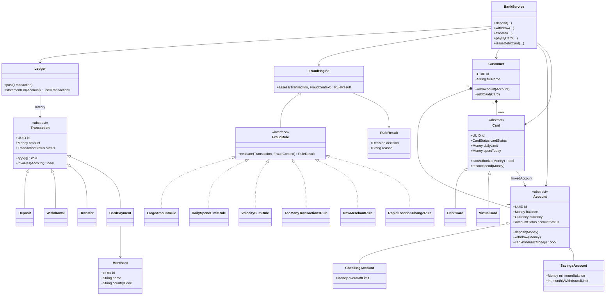

# UML Class Diagram

High-level class diagram of the domain, rules, and service layers, showing key fields/methods and relationships (inheritance, composition, association, and interface implementation).

